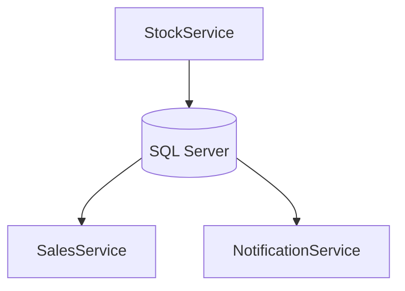

# StockService Microservice

Microserviço responsável pelo gerenciamento de estoque de produtos.

## Pré-requisitos

- .NET 9.0 SDK
- Banco de dados SQLITE

## Como Executar

1. Clone o repositório
2. Navegue até a pasta do StockService
3. Execute:


O serviço estará disponível em: http://localhost:5202

## Endpoints Principais

- `POST /api/Auth/register` - Para autenticar o usuário
- `POST /api/Auth/login` - Para autenticar o usuário 

- `GET /api/products` - Lista todos os produtos
- `GET /api/products/{id}` - Obtém um produto específico
- `POST /api/products` - Cria um novo produto
- `PUT /api/products/{id}` - Atualiza um produto

- POST `/api/Orders`  - Criar uma nova Order
- GET  `/api/Orders`  - Lista todos as Order
- GET  `/api/Orders/{id}` - Obtém uma Order específica

- POST `/api/OrderItems`  - Criar novos Itens Order
- DELITE  `/api/OrderItems/{id}`  - Deletar algum dos Itens
- GET  `/api/OrderItems/{id}` - Obtém os Itens da Order específica 
- GET `api/OrderItems/Promotion/Availability` - Obtém quantos itens está disponivel na promoção


## Migrações do Banco de Dados

Para aplicar migrações durante o desenvolvimento:

```bash
dotnet ef database update
```

## Diagrama de Arquitetura

