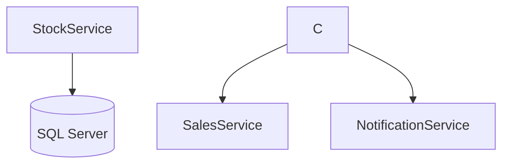

# StockService Microservice

Microserviço responsável pelo gerenciamento de estoque de produtos.

## Pré-requisitos

- .NET 9.0 SDK
- Banco de dados SQLITE

## Como Executar

1. Clone o repositório
2. Navegue até a pasta do StockService
3. Execute:


O serviço estará disponível em: http://localhost:5202

## Endpoints Principais

- `GET /api/products` - Lista todos os produtos
- `GET /api/products/{id}` - Obtém um produto específico
- `POST /api/products` - Cria um novo produto
- `PUT /api/products/{id}` - Atualiza um produto


## Migrações do Banco de Dados

Para aplicar migrações durante o desenvolvimento:

```bash
dotnet ef database update
```

## Diagrama de Arquitetura

